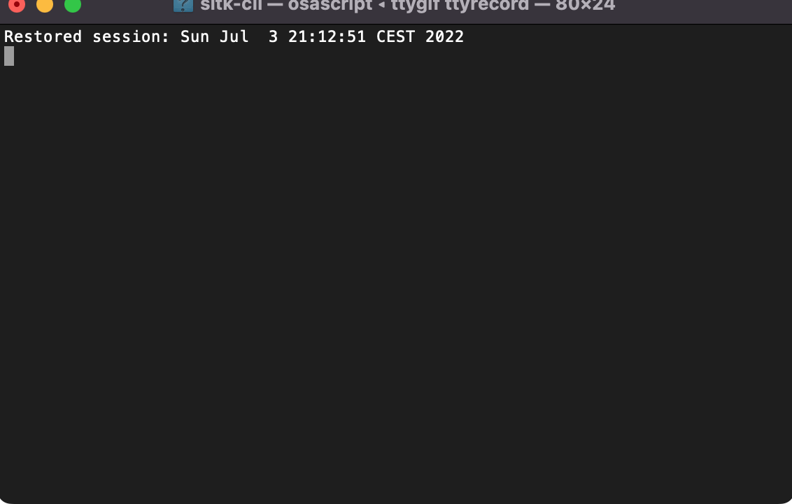

# Wrap SimpleITK functions as command lines

[](https://github.com/dyollb/sitk-cli/actions)
[](https://https://opensource.org/licenses/MIT)
[](https://badge.fury.io/py/sitk-cli)

## Overview

Create simple command line interface from functions that use [SimpleITK](https://github.com/SimpleITK/SimpleITK) images (and transforms) as arguments or return type.


```Python
import SimpleITK as sitk
import typer

from sitk_cli import make_cli


def fill_holes_slice_by_slice(mask: sitk.Image) -> sitk.Image:
    mask = mask != 0
    output = sitk.Image(mask.GetSize(), mask.GetPixelID())
    output.CopyInformation(mask)
    for k in range(mask.GetSize()[2]):
        output[:, :, k] = sitk.BinaryFillhole(mask[:, :, k], fullyConnected=False)
    return output


if __name__ == "__main__":
    typer.run(make_cli(fill_holes_slice_by_slice))
```

## Installation

```sh
pip install sitk-cli
```

## Demo

